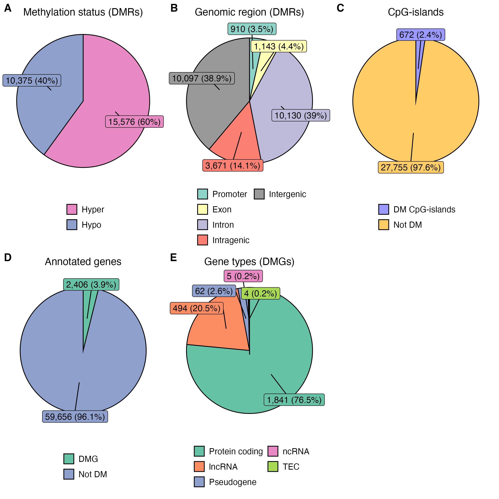

# Research Trends in Toxicology

This repo holds the code needed for **Methylome Analysis** lecture in the [_Research Trends in Toxicology course_](https://www.su.se/english/education/course-catalogue/mi/mi8016). The lecture generates figure 1 and 3 from the [PFOS MCF10A EMseq](https://doi.org/10.1016/j.scitotenv.2024.174864) paper.

# Agenda

+ Reproduce figure 1 and 3 from the [PFOS EM-seq paper](https://doi.org/10.1016/j.scitotenv.2024.174864).
+ Share code for the process coverage files => DMR table (csv)
+ Make slide showing the workflow of the methylome analysis
+ Write stand along code to reproduce the figures

---

# 🖥️ Computational analysis

## 🧬 Alignment & coverage

> [!NOTE]
> This process is beyond the scope of this lecture. In short, the [nfcore/methylseq:1.6.1](https://nf-co.re/methylseq/1.6.1) was used to align the reads to the reference genome and generate the coverage files (`*.cov.gz`).

## Differential methylation analysis

We want to identify the **D**ifferentially **M**ethylated **R**egions (DMRs) focusing on CpG-sites - but we still call them regions. These DMRs are overlapped with annotated gene positions to identify **D**ifferentially **M**ethylated **G**enes (DMGs), with genes being considored if a DMR is found inside the promoter or the exon, as these genomic regions when influced by DNA methylation affect the transcription machinery. DMR inside introns are not considored. Lastly, the identified DMGs are tested for gene pathway enrichment to understand which gene pathways are affected by PFOS exposure.

For this we need to complete the follow steps:

1. [Map CpG-sites](#1-map-cpg-sites)
2. [Extract Ensembl dataset](#2-extract-ensembl-dataset)
3. [Differentially methylated regions](#3-differentially-methylated-regions)
4. [Overlap DMRs with genomics regions](#4-overlap-dmrs-with-genomics-regions)
5. [Calculate pathway enrichment scores](#5-calculate-pathway-enrichment-score)
6. [Generate figure 1](#6-generate-figure-1)
7. [Generate figure 3](#7-generate-figure-3)

## 1. Map CpG-sites

Extract the exact positions of `CG`-motifs in the human genome, save as text file `data/cpg_positions.txt.gz`. This table will be used to filter out only the CpG-sites for downstream analysis. To generate the file run this in the terminal (or run the script inside Positron / Rstudio):

```sh
Rscript bin/cpg_positions.R
```

The script requires the following R-packages: `BSgenome.Hsapiens.UCSC.hg38` and `readr`.

<details>
  <summary>How to install R-packages</summary><br>

  > Assuming you have R already installed
  
  Basic R-packages are installed from [CRAN](https://cran.r-project.org/) (`install.packages()`) while bioinformatic R-packages are installed from [Bioconductor](https://bioconductor.org/) (`BiocManager::install()`). In order, to install from Bioconductor we need first to install the [Bioconductor Manager](https://bioconductor.org/install/), see code below:
  
  ```r
  # Install Bioconductor manager
  install.packages("BiocManager")
  
  # Install from CRAN
  install.packages("readr")
  
  # Install from Bioconductor
  BiocManager::install("BSgenome.Hsapiens.UCSC.hg38")
  ```
  
  Install packages like this will download the latest version. Exact version numbers are important for reproducibility.
</details>

<details>
  <summary>Run code with containers</summary><br>

  Use a singularity container with a pre-install environment (OS, R, packages). Run with apptainer / singularity

  ```sh
  # Save container as a variable
  METH_SIF='library://andreyhgl/singularity-r/methylome'

  # Run the container
  apptainer exec $METH_SIF Rscript bin/cpg_positions.R
  ```
</details>

Will generate `data/cpg_positions.txt.gz`.


## 2. Extract Ensembl dataset

[Ensembl](https://ensembl.org/) is a public project providing access to reference genomes and gene annotations. We will be extracting all the known coding and non-coding genes gene positions.

```sh
Rscript bin/ensembl.R
```

Will generate `data/ensembl_table.csv.gz`.


## 3. Differentially methylated regions

Calulate **D**ifferentially **M**ethylated **R**egions (DMRs) focusing on CpG-sites - but we still call them regions.

This script is computationally heavy: requires 500Gb ram, 10 cpus and runs for 1,5h. Hence, it's best ran on a computer cluster, like [UPPMAX](https://www.uu.se/centrum/uppmax/resurser/kluster). 

```sh
Rscript bin/diffmeth.R
```

Will generate `data/diffmeth.csv.gz`.


## 4. Overlap DMRs with genomics regions

Find out which genomic regions (promoter, exon, intron, intergenic, CpG-islands) overlap with the DMRs.

> [!NOTE] 
> We'll need two tables that hold the information for CpG-islands position and genome annotations, both of which can be downloaded from University of [California Santa Cruz (UCSC) Genomics Institute](https://genome-euro.ucsc.edu/index.html). These files are included in the repo, inside `data/`.

<details>
  <summary>Download genome annotations</summary><br>

  Annotations can be exported from the [Table Browser tool](https://genome-euro.ucsc.edu/cgi-bin/hgTables) at UCSC database. To download the annotations set the parameters as follow:

  + CpG-islands annotations, save as `cpgislands_GRCh38.bed`
  
  ```
  clade = "Mammals" 
  genome = "Human"
  assembly = "Dec. 2013 (GRCh38/hg38)"
  group = "Regulation"
  track = "CpG-islands"
  table = "cpgIslandExt"
  output format = "BED"
  output filename = "cpgislands_GRCh38.bed"
  
  <click> "get output" 
  <click> "get BED"
  ```
  
  + [Refseq](https://en.wikipedia.org/wiki/RefSeq) annotations, save as `refseq_UCSC_GRCh38.bed`
  
  ```
  clade = "Mammals" 
  genome = "Human"
  assembly = "Dec. 2013 (GRCh38/hg38)"
  group = "Genes and Gene Predictions"
  track = "NCBI RefSeq"
  table = "UCSC RefSeq (refGene)"
  output format = "BED"
  output filename = "refseq_UCSC_GRCh38.bed"
  
  <click> "get output" 
  <click> "get BED"
  ```
</details>

```sh
Rscript bin/methtable.R
```

Will generate `data/PFOS_MCF-10A_DMR.Rds`

Additionally, a table from the gene perspective (each row is a gene), is useful from an explanatory approach.

```sh
Rscript bin/genetable.R
```

Will generate `data/PFOS_MCF-10A_DMG.Rds`


## 5. Calculate pathway enrichment scores

Use the R-packages [`clusterProfiler`](https://bioconductor.org/packages//release/bioc/html/clusterProfiler.html) and [`org.Hs.eg.db`](https://www.bioconductor.org/packages/release/data/annotation/html/org.Hs.eg.db.html) to calculate pathway enrichment scores.

<!-- 

This section needs fixing!

data/PFOS_MCF10A_GO.Rds is copied from the original project. For some reason
I could not run the script inside the container, perhaps org.Hs.eg.db is the
problem

-->

```sh
Rscript bin/gene_ontology.R
```

Will generate `data/PFOS_MCF-10A_GO.Rds`


## 6. Generate `figure 1`

Generate figure 1 from [PFOS MCF10A EMseq](https://doi.org/10.1016/j.scitotenv.2024.174864) paper. The figure is composed of five plots:

1. Methylation status of DMRs
2. Genomic regions of DMRs
3. DM CpG-islands
4. Genes overlapping DMRs
5. Gene types of DMRs overlapping with promoter, exon and/or CGI

```sh
Rscript bin/figure1.R
```

<details>
  <summary>Figure 1</summary><br>
  
  
</details>


## 7. Generate `figure 3`

Generate figure 3 from [PFOS MCF10A EMseq](https://doi.org/10.1016/j.scitotenv.2024.174864) paper. The figure shows pathway enrichment results with GO terms matching the following keywords:

+ motor
+ actin
+ adhesion
+ growth
+ collagen
+ myosin
+ microtubule
+ cytoskeletal
+ junction
+ extracellular
+ locomotion

These keywords are matched against the gene description and are relevant genes for PFOS induced phenotypes (previously demonstrated [Pierozan and Karlsson, 2018](https://doi.org/10.1007/s00204-017-2077-8)).

```sh
Rscript bin/figure3.R
```

<details>
  <summary>Figure 3</summary><br>

  
</details>